# Instructions for assembly
This is a translation of the original Serbian language instructions for assembling the 40th year anniversary Galaksija.

The original can be found [here](https://racunari.com/galaksija/uputstvo-za-sklapanje/lemljenje/)

The translation follows the original as closely as possible.
However a few details which only work in Serbian, such as colloquial terms given in quotes and some wordplay, have been left out or adapted.

## Soldering
In electronics, soldering is a simple and routine task which can be mastered in a short time. 
It's all a matter of practice, however many try to mystify soldering, and to make it seem more complicated than it is.
Nevertheless, some mistakes made when soldering are hard to fix, so if you don't have experience, it's best to experiment at least 20 minutes on some "harmless" project,
before you move on to a project which is important.
But ideally, you would have someone who has experience present, who will intervene only when needed.

To start, you will need a desk, preferably as large as possible, because sooner or later, you will see that you need more working space.
Lighting must be perfect, and a lamp which can be moved in all directions is a must, so that its position can be adjusted as needed.
An extension lead with a few sockets is also necessary, as you will soon find out that you're missing just one socket, and then another...

### Soldering iron

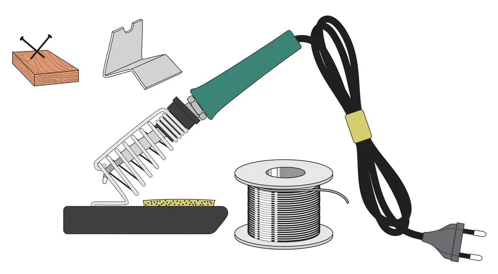

The soldering iron, is of course the most important tool.
While not necessary, it can be handy to have a soldering iron, with a separate station for controlling the temperature.
A holder which will hold your soldering iron securely while you're not using it, is also necessary.
You can improvise a holder with a piece of sheet metal, or even a piece of wood with two crossed nails in it.
Any solution will be better than a soldering iron sitting at the edge of your table, waiting to hurt or damage everything which touches it, or on which it falls.

### Solder wire

Soldering wire is the next important item.
You can choose whether you want to use lead free solder, or regular solder with lead.
However, you should know that lead free solder is much harder to work with, as it requires a much higher temperature to melt.
It's easier to use regular solder with lead, and you can easily avoid it's harmful effects by ensuring your workspace is well ventilated, or even using a fan.
Special extractors for fumes exist, but it's easy to improvise a small fan, for example from a computer power supply.

When buying soldering wire, pay attention to it's thickness.
For soldering the Galaksija, a wire around 0.5mm thick will be fine.

### Soldering tip

The most important detail, in all of the tools, is the quality of the soldering iron's tip.
It's impossible to do a good job with a greasy and corroded tip, even if you've bought the best, most expensive tools.
Luckily, all manufacturers of soldering irons also sell spare tips, which should be changed regularly.
It's good to know that when first heating a new soldering iron and tip, the tip should be "tinned" as soon as possible, ideally as soon as the iron is hot enough to melt solder.
If you miss this step, the tip will oxidise very quickly, but just one drop of solder applied at the right moment can save the tip.

### Flux

Alongside good-quality solder wire, a little flux will also be useful: a substance which cleans solder pads, removes metal oxides and evens out the surface tension of the melted solder.
Here (in Serbia), it's sold under the name "solder paste" or "paste for soldering".
> **Translator's note:** In English, this is sold as "flux" or "flux paste"

Avoid old-style fluxes in big tubes, they are only good for soldering gutters.

In the past, a natural resin called rosin was used just as successfully, but synthetic flux is far more versatile.
It's true that every solder wire already contains a certain amount of flux, which you can easily see in the core of the wire, but for some jobs, especially soldering SMD (surface-mount device) components, extra flux is needed.

Along with these "cosmetics", it's also useful to have a special compound for reconditioning your soldering iron's tip, sold under the name "Tip Tinner", but it's harder to find in Serbia.
This substance, which is actually a mix of a special solid flux and microscopic grains of solder, can extend the tip's lifespan and prepare it well before you start work.

### Other tools

A few other tools will be of use, so you ought to have them at hand.
Small side cutters, a few different screwdrivers, a magnifying glass for inspecting fine details, a small pair of tweezers and a desoldering pump for removing solder.

The pump has a plunger with a spring that compresses, and when it's released by pressing the trigger, it sucks up all the solder from the solder joint (once you've melted it with the iron).
This simple tool is a standard part of every professional's toolbox, as it's handier to use than any complicated and expensive desoldering station.

### Soldering technique

If you can overcome the desire to work quickly,
at each soldered joint, wait at least one extra second, where you don't move anything, just hold the iron on the joint you're soldering.
Don't worry about damaging the components by holding the iron a bit extra, electronic components are much more resistant to heat than you might think.
The Galaksija has exactly 700 solder joints, so holding your iron extra will cost you a bit more than 10 minutes, however it will vastly improve the quality.

### Common soldering mistakes

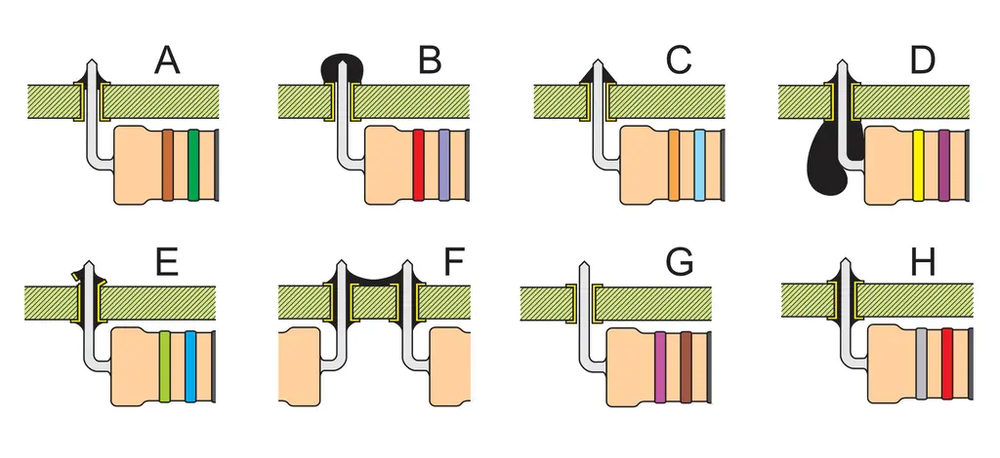

The most common mistakes made when soldering, are the following:
<ol type="A">
  <li>Not enough solder. This connection is very weak, but fortunately it's easy to notice and fix.</li>
  <li>
      Too much solder and not enough heating. This is the worst joint you can make, and it is known as a "cold joint".
      The internal forces from cooling will probably
  </li>
  <li>Third item</li>
  <li>
      Too much solder. You'll need a bit of experience to be able to gauge how much solder to use for each joint.
      This type of joint is not by itself bad, at least if it hasn't made a short circuit, but it's ugly, and every 
  </li>
  <li>5</li>
  <li>A short circuit between two adjacent connections. This is a common mistake, so after soldering you should carefully inspect your board.</li>
  <li>
      A missed spot during soldering. 
      Whether it's because of hastiness or poor concentration, this is a mistake which even the most experienced professionals make.
  </li>
  <li>There's no mistake here. The connection is soldered correctly.</li>
</ol>

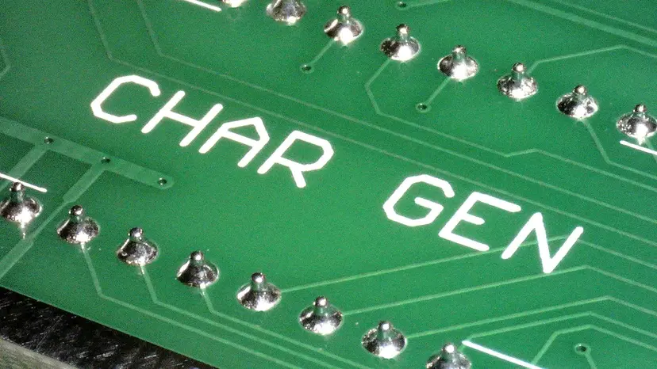

### Soldering SMD Components

If you don't have much experience with soldering, the most challenging part will be the small EEPROM in an SMD package.
But don't worry! 
It's good if you already have experience, but patience and paying careful attention will help much more.

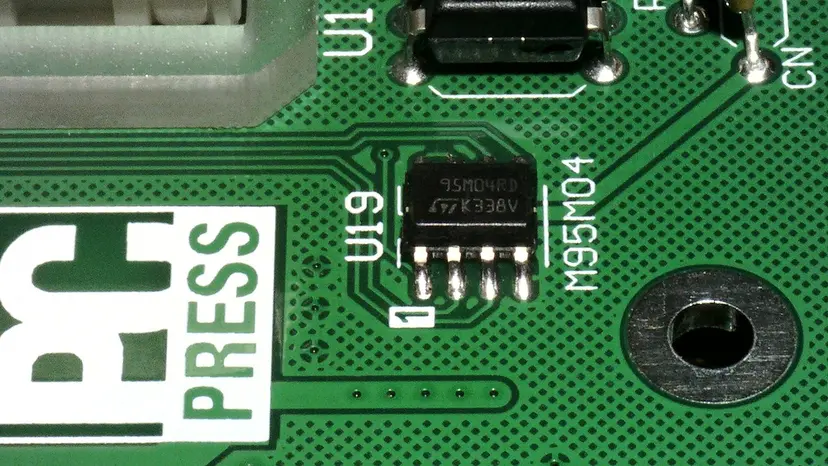

It's not hard to solder the SMD chip, especially if you have a soldering iron with a fine and clean tip.
First of all, a thin layer of solder needs to be applied to two diagonally opposite pads on the PCB for chip U19.
Then, you position the chip (making sure it's correctly oriented), and press the soldering iron on the pins where solder is already on the pad.
When the heat transfers from the pin to the solder, the pin will be soldered, not very securely, but enough to keep the chip in place.

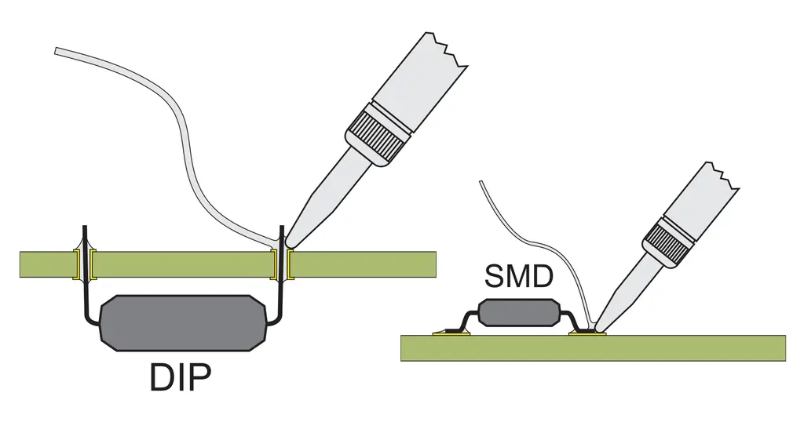

### Recap and extra details

If you don't have any flux for soldering, the one already inside the solder wire will be enough.

A few things here are very important, so we'll repeat them.
The soldering will be more successful, if your solder wire is not thick.
For soldering all of the components on Galaksija, it would be best to have two types of solder wire, around 0.4mm and around 0.6mm, but one wire of 0.5mm will be a good alternative.
However, the most important detail is the quality of the soldering iron's tip.
All modern soldering irons have swap-able tips, so it might be worthwhile to buy at least one new tip.
Straight away after turning the iron on, you should put solder on the tip, as otherwise, a dry tip can oxidize and become unusable in only a few minutes.

There also exists an alternative method for soldering SMD components, using a special paste which holds miniature, barely visible balls of solder in flux

### Order of Soldering Components

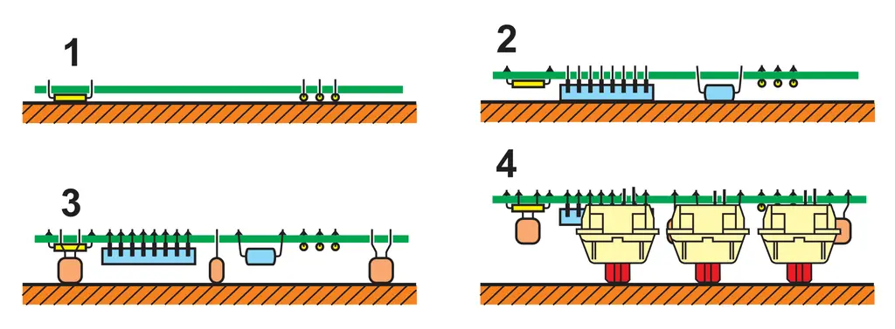

You might think that the order in which you solder the components doesn't matter, but you can save yourself a lot of trouble, if you organize your work properly.
The visibility of each stage of work will be best, if you at first solder the components which are lowest: 
the resistors and the diodes (at least D1-D4, leave D5 till later as it's bigger).
When you flip the board so as to solder the components, it'll be clear why you didn't rush to place the larger components as well: the resistors and diodes, which are the smallest and lowest components, won't fall out, but they'll be pressed against the table.

When you cut the excess wires after soldering, you'll see that everything is in it's place, and that none of the resistors are "hanging" by their wires.

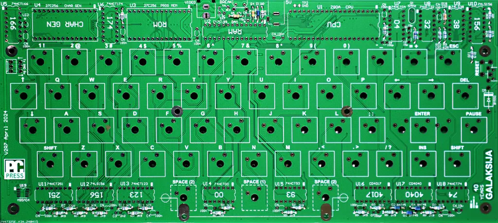

Now you can solder the integrated circuits and IC sockets, which are currently empty, then the capacitors with 5mm lead pitch, which are a bit taller, and finally the connectors and vertical button (for a hard-break).
Now would also be a good time to place the programmed EPROMs in their sockets.

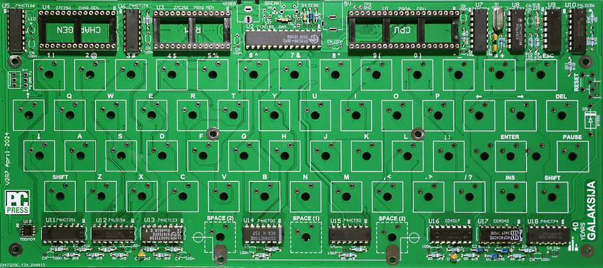

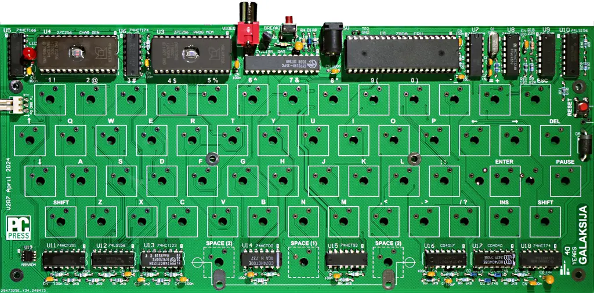

## Connecting and Getting Started

It's simple to launch the Galaksija. Before all else, you need a monitor. Any modern TFT monitor or television will suit, which will be connected easily if it has a composite video input, which you can recognise by the RCA connector, like the one shown below:

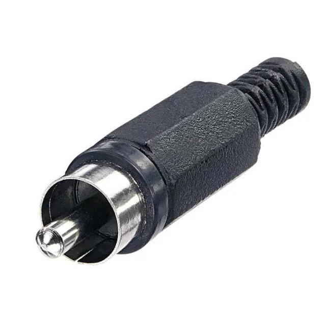

If you don't have a monitor with a composite video input, you can use a monitor with an HDMI input (which all monitors have nowadays) paired with a video converter to HDMI, which will be easily found in the Serbian market, under a name which looks like AV to HDMI adapter and isn't too expensive.
Before buying, pay attention to the label, these adapters usually convert in one direction, so you would be making a mistake if you buy an HDMI to AV adapter.
Apart from that, keep in mind that this device is active, that is, it needs power, which is normally provided with a USB charger.
You will also need an RCA cable to carry the video from the Galaksija to the adapter, as well as an HDMI cable for the connection between the adapter and monitor.

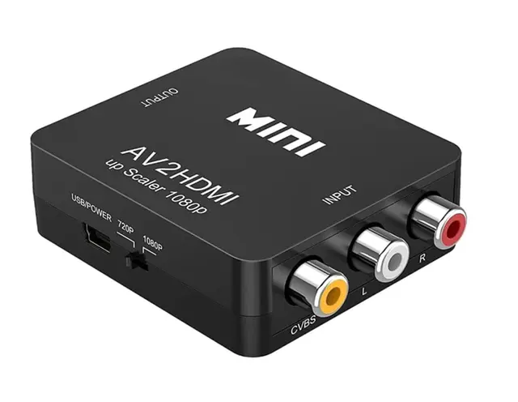

While the Galaksija will work with any modern monitor, its 32 symbols per line and capital letters look a bit unusual on a screen 32" and bigger.
That's why if you can choose, buy a monitor 8, 9 or 10" in size, with a screen ratio of 4:3 as opposed to the usual ratio of 16:9.
Such monitors are usually sold for CCTV monitoring.

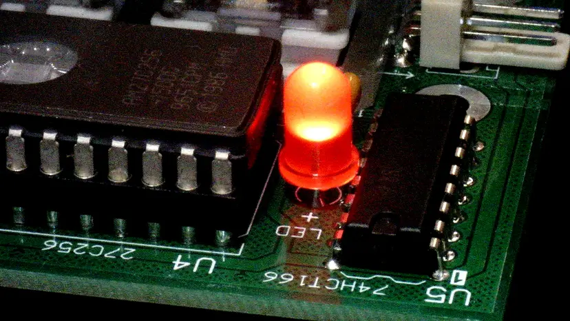

The Galaksija will work as soon as you plug it in, which is indicated by the LED on the left side of the board, 
and the message "READY" will immediately show up on the screen.

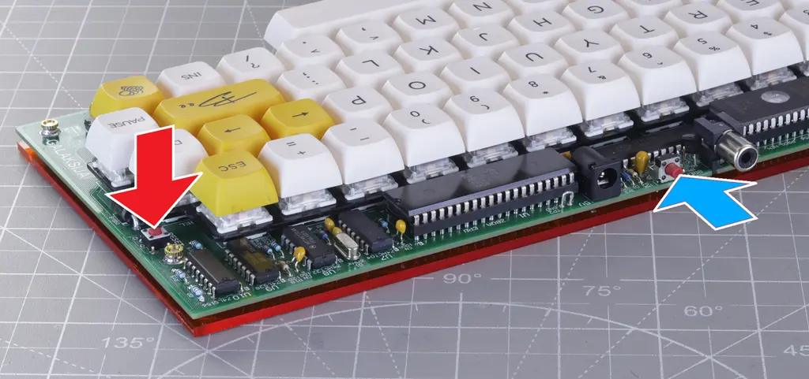

So, if everything is fine, the message will show on the screen after turning on.

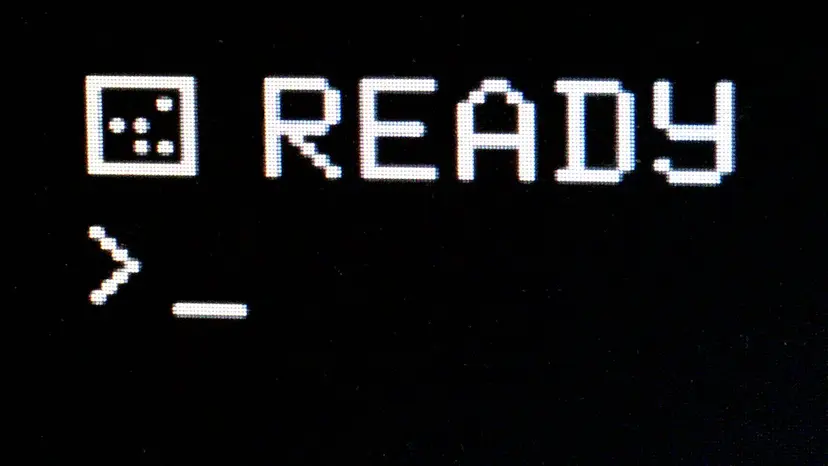

## Keyboard

A mechanical keyboard with standard dimensions proved itself to be a good choice for the original Galaksija computer, so there wasn't a reason to change that practice now.
In the meanwhile, Cherry created a good standard for mechanical keyboard switches, so it was easy to settle on the hole and pad positions for the PCB.

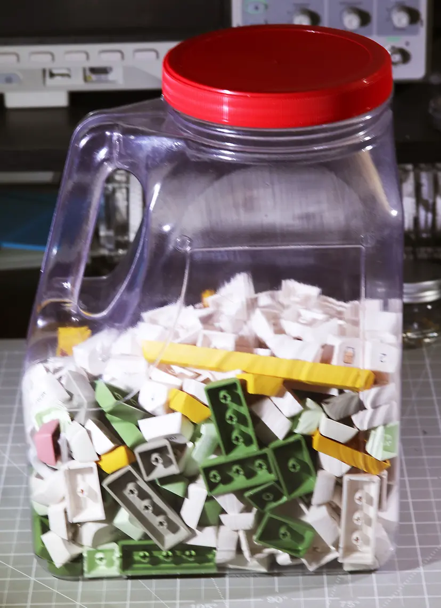

56 switches are needed for the Galaksija, but you should buy at least 60, and keep the extras as spares.
The actual switches (this does not apply to the keycaps) come in 8 different colours.
Actually, those are only the colours of the central stems, which can't be seen after you put the keycaps on, but they serve the purpose of differentiating between different switch weights.
For example, red and brown are the softest (45g) and the most quiet (the first is completely silent), while white and clear are the hardest (80g) and noisiest.
Blue and green are popular with gamers, as they have a moderate weight and a hard "click", while black are the same weight, but without a click, so they're good for professionals in offices with many people.

## Mask for the keyboard
## Case
## Power
